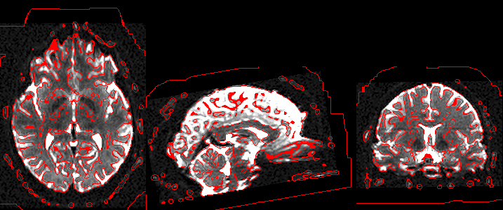

## About

This repository provides a Python implementation for finding edges in a NIfTI image using the the [Marr–Hildreth algorithm](https://en.wikipedia.org/wiki/Marr–Hildreth_algorithm). They noted that the [Difference of Gaussian](https://en.wikipedia.org/wiki/Difference_of_Gaussians) (DoG) approximates the second derivate of Gaussian (the [Laplacian of Gaussian](https://en.wikipedia.org/wiki/Blob_detection#The_Laplacian_of_Gaussian) (LoG)). The method is illustrated below. The raw image (top) is blurred with two Gaussians (here with a 2.0 and 3.2mm [FWHM](https://en.wikipedia.org/wiki/Full_width_at_half_maximum) (middle), the edges are defined as the zero-crossing of this image (bottom).



The [Canny Edge Detector](https://en.wikipedia.org/wiki/Canny_edge_detector) is superior for many 2D applications. However, DoG has several appealing characteristics for 3D medical imaging. First, the Canny method requires image brightness thresholds that are hard to define for MRI modalities where image brightness is relative. Second, the Canny edge tracking by hysteresis is difficult for 3D images (and therefore not implemented by popular tools). In contrast, the DoG uses a spatial threshold, and the size of features in the human brain are known and relatively constant. Furthermore, optimized Gaussian blurs are implemented in most neuroimaging pipelines, making the DoG edge detection simple to compute.

## Usage

You provide two arguments: the name of the NIfTI image to process and the size of the Gaussian (the code will apply two Gaussians, with radii of x1.0 and x1.6 specified). The program will create a new 3D binary edge map in NIfTI format.

```
python dog.py ./DWI.nii.gz 4
```

## Links

 - [Additional sample images](https://github.com/neurolabusc/DoG)
